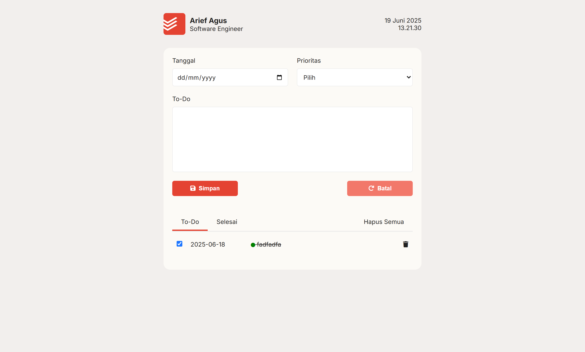

# 📝 Simple Todoist Clone

A simple Todoist-like application built using **HTML**, **CSS**, and **JavaScript**. This minimalist to-do app lets you manage tasks with priorities, tabs for active and completed tasks, and options to delete individual or all tasks.

## 🔧 Features

- ➕ Add new todo items with a priority level
- ✅ Mark todos as complete (with strikethrough effect)
- 📂 Toggle between **Todo** and **Completed** tabs
- 🗑️ Delete individual tasks or clear all todos

## 📸 Screenshot



## 🚀 Live Demo

👉 [Live Demo on Vercel](https://simple-todoist-clone.vercel.app/)

## 📂 Project Structure

```bash
indonesian-resto/
├── images/
├── index.html
├── main.css
└── main.js
```

## 💻 How to Run Locally

1. Clone the repository:

   ```bash
   git clone https://github.com/argus1995/simple-todoist-clone.git
   cd simple-todoist-clone
   ```
2. Open index.html in your browser:

- Double-click the file, or

- Use a local development server like VS Code’s Live Server extension.

## 📝 License

This project is open-source and available under the MIT License.
